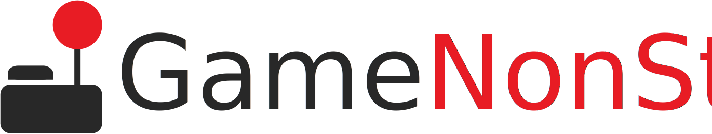

<div align="center">
  
  
  </br>

  **A modern gaming platform that brings the gaming world to your fingertips**
  
  Explore our vast collection of the latest releases, timeless classics, and exclusive deals on your favorite games.
</div>

## 🌟 Features

- **Game Store**: Browse and purchase the latest and classic games
- **User Authentication**: Secure login and registration system with Google OAuth integration
- **Shopping Cart**: Add games to cart and manage your purchases
- **Payment Processing**: Secure payment system with multiple payment methods
- **User Profiles**: Personalized user experience with profile management
- **AI-Powered Chat**: Gemini AI integration for enhanced user interaction
- **Email Support**: Contact support system for user assistance
- **FAQ Section**: Comprehensive help and support documentation
- **Responsive Design**: Mobile-friendly interface with modern UI/UX

## 🛠️ Technologies Used

### Frontend
- **React 18** - Modern JavaScript framework
- **React Router DOM** - Client-side routing
- **Vite** - Fast build tool and development server
- **Tailwind CSS** - Utility-first CSS framework
- **Bootstrap** - Component library
- **React Bootstrap Icons** - Icon library
- **React Slick** - Carousel component
- **SweetAlert2** - Beautiful alert dialogs
- **React Helmet** - Document head management

### Backend
- **PHP** - Server-side scripting
- **MySQL** - Database management
- **Google OAuth** - Authentication service
- **EmailJS** - Email service integration

## 🚀 Getting Started

### Prerequisites
- Node.js (v16 or higher)
- npm or yarn
- PHP (v7.4 or higher)
- MySQL database
- Python 3.x (for web scraping features)

### Installation

1. **Clone the repository**
   ```bash
   git clone https://github.com/AmIWhatIAm/gamenonstop.git
   cd gamenonstop
   ```

2. **Install dependencies**
   ```bash
   npm install
   ```

3. **Set up the database**
   - Create a MySQL database
   - Import the database schema from `src/backend/db.sql`
   - Configure database connection in PHP files

4. **Configure environment variables**
   - Set up Google OAuth credentials
   - Configure email service settings
   - Set database connection parameters

5. **Start the development server**
   ```bash
   npm run dev
   ```

## 📜 Available Scripts

- `npm run dev` - Start development server
- `npm run build` - Build for production
- `npm run preview` - Preview production build
- `npm run lint` - Run ESLint
- `npm run deploy` - Deploy to GitHub Pages

## 🔧 Configuration

### Vite Configuration
The project uses Vite for fast development and building. Configuration is in `vite.config.js`.

### Tailwind CSS
Styling is handled by Tailwind CSS with custom configurations in `tailwind.config.js`.

### Database Configuration
Database connection settings are configured in the PHP backend files located in `src/backend/php/`.

## 🌐 API Endpoints

### PHP Backend
- `login.php` - User authentication
- `register.php` - User registration
- `get_game.php` - Fetch game data
- `add_to_cart.php` - Add items to cart
- `remove_from_cart.php` - Remove items from cart
- `payment.php` - Process payments
- `searchGame.php` - Search games

## 🎨 UI/UX Features

- Modern, responsive design
- Dark/light theme support with matching logo variants
- Smooth animations and transitions
- Mobile-first approach
- Accessible user interface
- Professional branding and logo system
- Consistent visual identity across all pages

## 🔐 Security Features

- Input validation and sanitization
- CORS configuration
- Protected routes and authentication

## 📱 Pages and Components

- **Main Page** - Homepage with featured games
- **Store Page** - Game catalog and browsing
- **Product Page** - Individual game details
- **Cart Page** - Shopping cart management
- **Login/Register** - User authentication
- **Profile Page** - User account management
- **FAQ Page** - Help and support
- **Support Page** - Contact and email system

</div>
